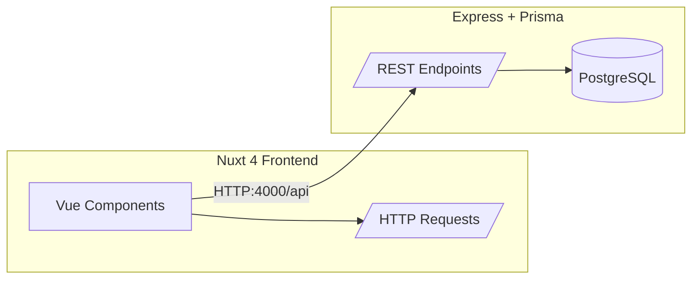

# 🧭 IATTA Adventure Travel — Fullstack Web Application

> Platform **IATTA Adventure Travel** dikembangkan dengan arsitektur **Fullstack Modern** menggunakan **Nuxt 4 (Vue 3 + Vite)** sebagai frontend, **Node.js + Prisma ORM** sebagai backend API, dan **PostgreSQL 14** sebagai basis data utama.  
> Seluruh sistem berjalan secara terorkestrasi menggunakan **Docker Compose**.

---

## 🧩 Teknologi Utama

| Komponen | Teknologi | Deskripsi |
|-----------|------------|-----------|
| **Frontend (Client)** | Nuxt 4 (Vue 3 + Vite + TailwindCSS 4) | Aplikasi SSR/SPA dengan layout modular `LandingPage` & `Dashboard` |
| **Backend (Server)** | Node.js + Express + Prisma ORM | API RESTful yang mengelola data pengguna dan konten |
| **Database** | PostgreSQL 14 | Basis data utama, persistent menggunakan Docker volume |
| **Styling** | TailwindCSS 4 + @tailwindcss/vite | Styling berbasis utility-first dengan integrasi Vite |
| **Containerization** | Docker + Docker Compose | Mengelola `client`, `server`, dan `db` dalam isolated containers |
| **ORM/Schema** | Prisma ORM | Manajemen schema, migrasi, dan seeding database |
| **Runtime Environment** | Node 20 (Alpine) | Lingkungan runtime yang ringan dan optimal untuk produksi |

---

## 📁 Struktur Proyek

```
.
├── client/                # Frontend Nuxt 4 App
│   ├── app/               # Root source directory
│   │   ├── assets/css/    # File Tailwind entry
│   │   ├── components/    # Reusable UI components (Navbar, Footer, dll)
│   │   ├── layouts/       # LandingPage.vue, Dashboard.vue
│   │   ├── pages/         # index.vue, about.vue, dashboard.vue, dst
│   │   └── app.vue        # Root App dengan <NuxtLayout> dan <NuxtPage/>
│   ├── nuxt.config.ts     # Konfigurasi utama Nuxt
│   └── Dockerfile         # Docker image untuk client
│
├── server/                # Backend API Service
│   ├── prisma/            # Prisma schema, migrations, dan seed data
│   ├── src/               # Express routes, controllers, dan services
│   ├── .env               # Environment variables server
│   └── Dockerfile         # Docker image untuk server
│
├── .env                   # Environment root untuk Docker Compose
├── docker-compose.yml     # Definisi dan orkestrasi service
└── README.md              # Dokumentasi utama (file ini)
```

---

### Client Environment (via Docker Compose)
```yaml
  client:
    environment:
      - NITRO_HOST=0.0.0.0
      - PORT=3000
      - API_BASE_URL=http://server:4000/api
```

---

## 🧑‍💻 Pengembangan Lokal

### 1️⃣ Instal dependensi
```bash
npm install
# atau
pnpm install
```

### 2️⃣ Jalankan Frontend
```bash
cd client
npm run dev
```
Akses di:
```
http://localhost:3000
```

### 3️⃣ Jalankan Backend
```bash
cd server
npm run dev
```
API tersedia di:
```
http://localhost:4000
```

---

## 🧱 Build Produksi

### Frontend
```bash
cd client
npm run build
npm run preview
```

### Backend
```bash
cd server
npm run build
npm run start
```

---

## 🐳 Jalankan dengan Docker Compose

### Build ulang seluruh image
```bash
docker compose build --no-cache client server
```

### Jalankan seluruh service
```bash
docker compose up -d
```

### Pantau logs
```bash
docker compose logs -f client server
```

### Hentikan semua container
```bash
docker compose down
```

---

## 🧰 Skrip Otomatis (Root-Level)

Tambahkan pada `package.json` di root:

```json
{
  "scripts": {
    "compose:config": "docker compose config",
    "compose:up": "docker compose up -d --build",
    "compose:down": "docker compose down",
    "compose:logs": "docker compose logs -f",
    "compose:build": "docker compose build --no-cache",
    "db:psql": "docker exec -it iatta-adventuretravel-db-1 psql -U rizkyajiekurniawan -d iatta_db",
    "db:seed": "docker exec -i iatta-adventuretravel-server-1 npx prisma db seed"
  }
}
```

### Jalankan cepat:
```bash
npm run compose:up
npm run db:psql
npm run db:seed
```

---

## 🧮 Prisma ORM Commands

```bash
# Generate Prisma client
docker exec -it iatta-adventuretravel-server-1 npx prisma generate

# Push schema ke database
docker exec -it iatta-adventuretravel-server-1 npx prisma db push

# Deploy migration ke DB
docker exec -it iatta-adventuretravel-server-1 npx prisma migrate deploy

# Jalankan seeder
docker exec -it iatta-adventuretravel-server-1 npx prisma db seed
```

---

## 🧱 Database Configuration

Database berjalan di dalam container PostgreSQL.

```
Host: localhost
Port: 5433
Database: iatta_db
User: rizkyajiekurniawan
Password: postgres
```

Akses via terminal:
```bash
docker exec -it iatta-adventuretravel-db-1 psql -U rizkyajiekurniawan -d iatta_db
```

---

## 🧭 Layout System

| Layout | Path | Deskripsi |
|---------|------|-----------|
| `LandingPage.vue` | `/app/layouts/LandingPage.vue` | Layout publik untuk Home, About, Contact |
| `Dashboard.vue` | `/app/layouts/Dashboard.vue` | Layout privat untuk area pengguna/admin |

Gunakan di halaman dengan:
```vue
<script setup>
definePageMeta({ layout: 'LandingPage' })
</script>
```

---

## 🎨 Styling & Frontend Tools

Menggunakan **TailwindCSS 4** terintegrasi dengan Vite:

```ts
// nuxt.config.ts
import tailwindcss from '@tailwindcss/vite'

export default defineNuxtConfig({
  srcDir: 'app/',
  css: ['~/assets/css/main.css'],
  vite: { plugins: [tailwindcss()] }
})
```

Entry CSS:
```
client/app/assets/css/main.css
```

---

## 🧠 Arsitektur Sistem



---

## 🚀 Deployment Notes

- Jalankan dengan `docker compose up -d` untuk deployment otomatis.  
- Pastikan file `.env` tidak dikomit ke repository publik.  
- Default port:  
  - **Client:** 3000  
  - **Server:** 4000  
  - **Database:** 5433  
- Untuk production, gunakan reverse proxy seperti **Nginx**, **Caddy**, atau **Traefik**.  
- Backup database volume secara periodik untuk menjaga integritas data.

---

## 🧾 Lisensi & Pengembang

**Project:** IATTA Adventure Travel  
**Maintainer:** `Rizky Ajie Kurniawan`  
**License:** MIT / Internal Use Only  
**Version:** 1.0.0  
**Last Updated:** November 2025

---

> _"Delivering reliable, maintainable, and containerized web ecosystems for scalable digital operations."_